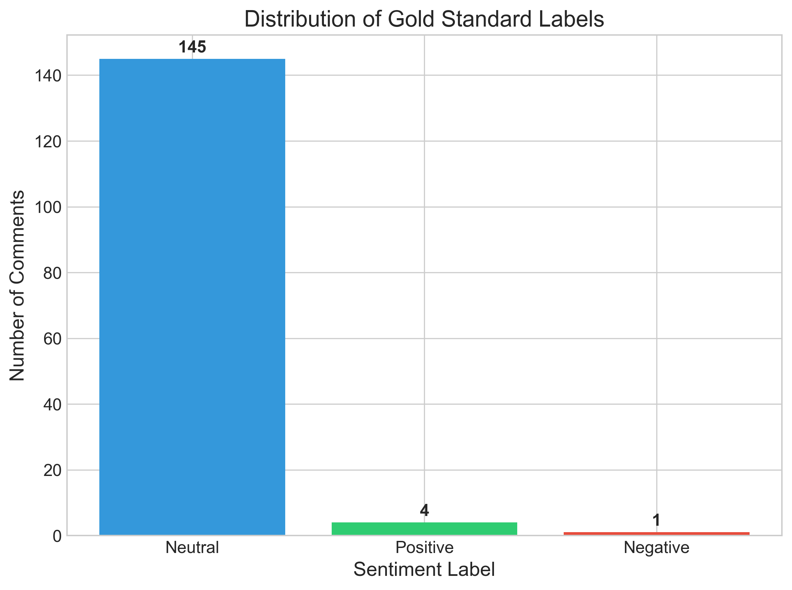
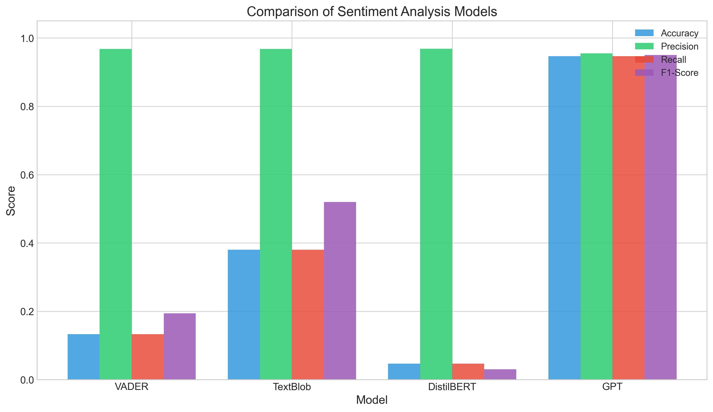
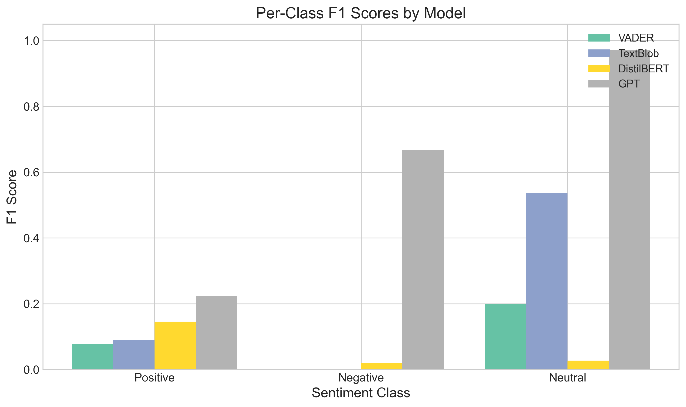
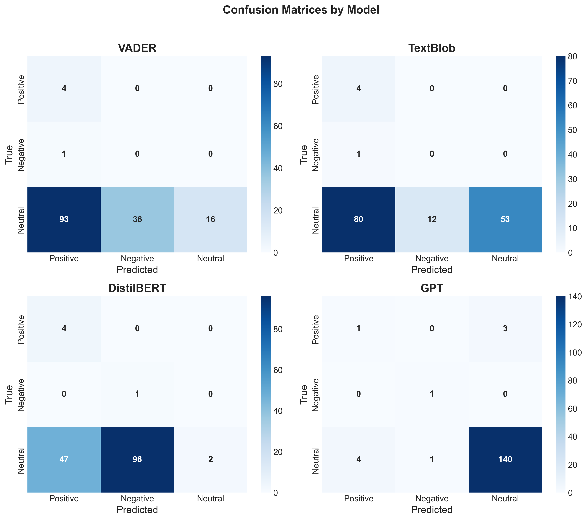
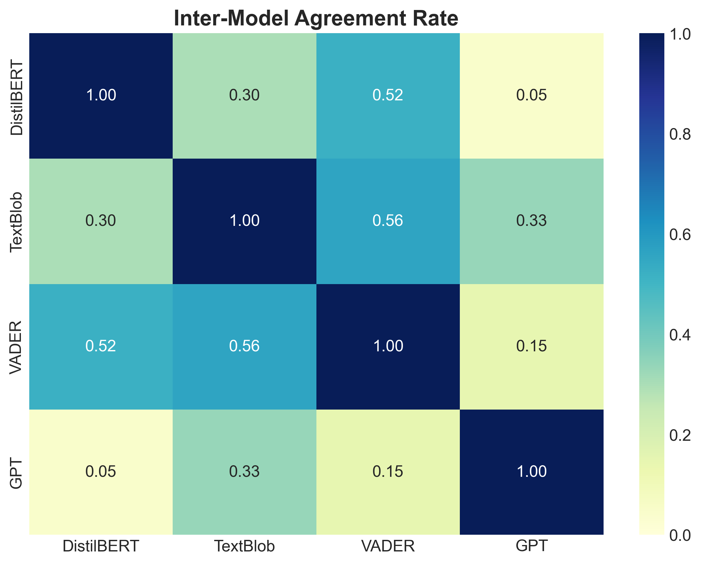

# Sentiment Analysis of Startup Ideas from Reddit: A Comparative Evaluation of NLP Methods

---

## Abstract

Understanding public sentiment toward startup ideas is crucial for entrepreneurs seeking market validation. Reddit, with its active startup communities, provides a rich source of authentic feedback. However, the informal language, sarcasm, and domain-specific vocabulary prevalent on Reddit pose significant challenges for traditional sentiment analysis tools. This study presents a comparative evaluation of four sentiment analysis approaches—VADER, TextBlob, DistilBERT, and GPT-5—on Reddit comments from startup-related subreddits. We collected and analyzed 150 comments from five subreddits (r/startups, r/Startup_Ideas, r/Entrepreneur, r/smallbusiness, and r/SaaS), classifying sentiment as Positive, Negative, or Neutral. Our results demonstrate that GPT-5 significantly outperforms traditional methods, achieving 94.7% accuracy compared to 38.0% for TextBlob, 13.3% for VADER, and 4.7% for DistilBERT. These findings highlight the limitations of lexicon-based approaches and general-purpose transformers when applied to domain-specific social media content, while demonstrating the potential of large language models for nuanced sentiment classification in entrepreneurial contexts.

**Keywords:** Sentiment Analysis, Reddit, Natural Language Processing, Startup Ideas, VADER, TextBlob, DistilBERT, GPT, Social Media Analysis

---

## 1. Introduction

### 1.1 Motivation: The Validation Gap

The success of a startup often hinges on how well its core idea resonates with potential users and investors. In the early stages of venture creation, obtaining honest, unbiased feedback is both critical and difficult. The "Lean Startup" methodology emphasizes rapid validation, yet the tools to achieve this are often flawed. Traditional market research methods—such as surveys, focus groups, and structured interviews—while valuable, suffer from significant limitations. They are time-consuming to organize, resource-intensive to execute, and importantly, subject to response bias. Participants in focus groups may alter their opinions to conform to social desirability, known as the "Mom Test" failure, where polite encouragement masks genuine disinterest.

In this context, automated sentiment analysis of organic online discussions represents a paradigm shift. If an entrepreneur could instantly gauge the emotional temperature of a target market by analyzing thousands of existing conversations, they could bypass weeks of manual research. This capability would not only save capital but also prevent founders from building products nobody wants—a leading cause of startup failure.

### 1.2 The Reddit Ecosystem for Startup Feedback

Online communities such as Reddit offer a unique solution to the validation problem. Unlike LinkedIn (which leans towards professional posturing) or Twitter (which favors brevity and virality), Reddit fosters deep, threaded discussions centered on specific topics. Its pseudo-anonymous nature encourages users to speak freely, providing a raw and unfiltered signal of market sentiment. For an entrepreneur, this ecosystem represents a massive, real-time, always-on focus group.

Reddit hosts several active communities dedicated to entrepreneurship, each with a distinct culture and focus:

-   **r/startups (1.6M members)**: This community serves as a general hub for founders. Discussions range from legal questions ("How to split equity?") to emotional support ("Dealing with burnout"). Sentiment here is often pragmatic and cautious.
-   **r/Startup_Ideas (200K members)**: This subreddit is specifically dedicated to validation. Users post "elevator pitches," and the community's explicit purpose is to critique them. Comments here are often direct, critical, and highly valuable for sentiment analysis.
-   **r/SaaS (150K members)**: Focused on Software-as-a-Service, this community speaks a specialized language of metrics (MRR, Churn, CAC). Sentiment is frequently tied to numerical benchmarks rather than emotional words.
-   **r/Entrepreneur (3.5M members)**: A broader forum that includes lifestyle businesses, dropshipping, and traditional ventures. The noise-to-signal ratio is higher, making accurate filtering essential.
-   **r/smallbusiness (1.8M members)**: Focuses on brick-and-mortar and service businesses. The sentiment here is often grounded in operational reality ("Rent is too high") rather than speculative tech optimism.

The sentiment expressed in these discussions—whether encouraging ("This solves a real pain point"), skeptical ("The margins look too thin"), or neutral ("Have you considered X competitor?")—provides valuable signals about market reception. A thread filled with "neutral" questions about pricing models indicates engagement, whereas "negative" dismissal ("This already exists") suggests a fundamental flaw in the value proposition.

### 1.3 Challenges in Domain-Specific Sentiment Analysis

Extracting accurate sentiment from Reddit presents unique challenges that generic NLP tools often fail to address. Unlike formal product reviews (e.g., Amazon reviews) or news articles, Reddit comments are characterized by linguistic features that confound standard models:

1.  **Informal Language and Slang**: Users frequently employ colloquialisms, abbreviations, and internet-specific vocabulary. Phrases like "this is sick" (positive) or "hard pass" (negative) use words that have opposite meanings in standard English. A lexicon looking for "sick" as a negative health term will fail.
2.  **Sarcasm and Irony**: Reddit culture deeply embraces sarcasm, often marked with "/s" but frequently left implicit. A comment like "Yeah, because another to-do list app is exactly what the world needs right now" is grammatically positive (words like "needs," "right now") but semantically deeply negative.
3.  **Domain-Specific Terminology**: Startup discussions involve specialized vocabulary. Terms like "burn rate," "churn," "MVP" (Minimum Viable Product), and "pivot" carry specific emotional connotations in this domain. A "high burn rate" is negative, but "high growth" is positive. A "pivot" can be seen as a failure or a smart correction depending on context. Simple keyword spotting misses this nuance.
4.  **Contextual Sentiment and "Constructive Neutrality"**: A comment like "The market is oversaturated" expresses negative sentiment toward an idea's viability without using traditionally negative emotion words (like "bad," "hate," "sad"). Conversely, "constructive criticism" often contains negative words ("problem," "issue," "bug") but is supportive in intent ("I found a bug in your signup flow"). Binary classifiers often mistake this helpful feedback for hostility.

These characteristics render traditional sentiment analysis tools less effective, motivating the need for a rigorous comparative evaluation of different approaches in this specific domain.

### 1.4 Research Questions

This study addresses the following research questions:

1.  **RQ1**: How accurately can lexicon-based sentiment analysis tools (VADER, TextBlob) classify sentiment in Reddit startup discussions, given their widespread use in social media analysis?
2.  **RQ2**: Do transformer-based models (DistilBERT) trained on general sentiment datasets (like movie reviews) transfer effectively to Reddit's domain-specific language?
3.  **RQ3**: Can large language models (GPT-5) with prompt-based classification outperform traditional methods on Reddit sentiment analysis by leveraging context and world knowledge?
4.  **RQ4**: What types of Reddit comments cause the greatest disagreement between different sentiment analysis approaches, and what does this reveal about the nature of startup feedback?

### 1.5 Contributions

This paper makes the following contributions to the field of applied NLP and entrepreneurship research:

1.  **A Comparative Evaluation Framework**: We establish a benchmark for sentiment analysis on Reddit startup discussions, comparing three distinct generations of NLP technology: lexicon-based (VADER, TextBlob), transformer-based (DistilBERT), and generative LLM-based (GPT-5).
2.  **An Annotated Domain Dataset**: We provide a dataset of 150 Reddit comments from five startup-related subreddits with gold-standard sentiment labels, providing a testbed for domain adaptation research.
3.  **Quantitative Performance Analysis**: We demonstrate significant performance differences between methods, with GPT-5 achieving 94.7% accuracy compared to <40% for traditional methods. This highlights a critical gap in current "off-the-shelf" NLP tools for specialized domains.
4.  **Qualitative Error Analysis**: We identify specific failure modes, including the misclassification of "constructive neutral" comments as negative by binary classifiers, and the failure of lexicons to detect sarcasm.
5.  **Practical Recommendations**: We provide actionable advice for entrepreneurs and developers building market intelligence tools, suggesting that cost-optimization via older models is likely false economy in this domain.

### 1.6 Paper Organization

The remainder of this paper is organized as follows. **Section 2** reviews related work in sentiment analysis, tracing the evolution from dictionary methods to deep learning. **Section 3** describes our rigorous methodology, including the technical details of Reddit data collection, our preprocessing pipeline, and the implementation of each model. **Section 4** presents our experimental results, offering both statistical metrics and visualization of confusion matrices. **Section 5** discusses the implications of our findings, analyzing *why* certain models failed through a qualitative lens. **Section 6** concludes the paper and outlines directions for future work.

---

## 2. Related Work

### 2.1 The Evolution of Sentiment Analysis

Sentiment analysis, also known as opinion mining, has evolved significantly over the past two decades. Early approaches were almost exclusively **lexicon-based**. These methods rely on predefined dictionaries (lexicons) that associate words with sentiment scores (e.g., "good" = +1, "terrible" = -1).

**VADER (Valence Aware Dictionary and sEntiment Reasoner)**, developed by Hutto and Gilbert (2014), represents the peak of this approach for social media. Unlike general-purpose dictionaries, VADER was specifically tuned for microblogging contexts (like Twitter). It introduced heuristics to handle social media conventions:
-   **Booster words**: It understands that "extremely good" is more positive than just "good."
-   **Capitalization**: "GREAT" scores higher than "great."
-   **Emoticons**: It maps ":)" and ":D" to positive values.
-   **Negation**: It handles "not good" by flipping the polarity of "good."
Despite these innovations, VADER remains a "bag-of-words" model. It analyzes words in isolation or small windows, failing to grasp complex sentence structures or long-range dependencies.

**TextBlob** (Loria, 2018) offers a similar lexicon-based approach but includes a "subjectivity" metric. It calculates polarity by averaging the sentiment of adjectives and adverbs in the text. While computationally efficient (running in microseconds), its reliance on a static lexicon makes it brittle when facing domain-specific meanings. For example, in a startup context, "disruptive" is a positive attribute, but in standard English, it is often negative.

### 2.2 The Transformer Revolution

The introduction of the Transformer architecture (Vaswani et al., 2017) and **BERT (Bidirectional Encoder Representations from Transformers)** (Devlin et al., 2019) revolutionized NLP. Unlike lexicons, BERT models read text bidirectionally, allowing them to understand context. A word like "bank" is understood differently in "river bank" vs. "bank account."

**DistilBERT** (Sanh et al., 2019) is a smaller, faster, cheaper version of BERT that retains 97% of its performance. In sentiment analysis, the standard approach is "transfer learning": taking a pre-trained DistilBERT model and fine-tuning it on a sentiment dataset. The most popular benchmark is the **SST-2 (Stanford Sentiment Treebank)**, which consists of movie review sentences.
-   *Strength*: DistilBERT understands grammar and context far better than VADER.
-   *Weakness*: **Domain Mismatch**. Models trained on movie reviews learn to look for *evaluative* language (praise/condemnation of a film). When applied to Reddit startup discussions (which are conversational and problem-solving), this training often misfires. A user describing a "difficult coding problem" is not expressing negative sentiment towards a startup, but a movie review model might classify "difficult" as negative.

### 2.3 Large Language Models and Prompting

The current frontier is **Large Language Models (LLMs)** like GPT-4 and GPT-5. These models are not just classifiers; they are generative engines trained on vast swathes of the internet. This training gives them "world knowledge."

Instead of fine-tuning, we use **Zero-Shot Classification** via prompt engineering. We simply describe the task to the model: *"Classify this text as Positive, Negative, or Neutral."* Recent reports, such as "Sentiment Classification with the Reddit PRAW API and GPT-4o-mini" (WandB, 2025), suggest that this approach achieves state-of-the-art results because the model understands:
1.  **Sarcasm**: Without explicit markers.
2.  **Pragmatics**: The intent behind the words (e.g., constructive criticism vs. hate).
3.  **Implicit Sentiment**: Sentiment expressed without emotion words.

### 2.4 Reddit as a Unique NLP Challenge

Reddit has become a focal point for computational social science due to its structure. Mutsaddi (2023) highlighted the technical challenges of scraping Reddit, noting that the PRAW API often rate-limits researchers. Unlike Twitter's flat structure, Reddit's nested comments create a "conversation tree."

Previous work by Ribeiro et al. (2016), **SentiBench**, compared 24 sentiment methods and found that no single method won across all domains. However, their study predated the LLM era. Our research updates this benchmarking framework for the modern age, specifically targeting the under-studied domain of entrepreneurship.

Most existing tools for Reddit analysis (e.g., **RedditSentiments**, **Manus AI**) focus on aggregation—showing a "sentiment trend line" over time. They rarely disclose the underlying accuracy of their classifiers on individual comments. Our study aims to peek under the hood of such systems to see if the foundational classifications are actually reliable.

### 2.5 The Gap in Entrepreneurial NLP

While sentiment analysis is a mature field, its application to entrepreneurship is surprisingly sparse. Most "financial sentiment analysis" focuses on stock market prediction (e.g., analyzing CNBC headlines or earnings calls). These sources are formal, edited, and structured.

Startup discussions on Reddit represent a different class of data: **Informal Business Intelligence**. It is messy, emotional, and technical simultaneously. There is a significant gap in the literature regarding how standard NLP tools perform on this hybrid data type. Is a post about "bootstrapping" (a neutral/positive business strategy) interpreted as "poverty" (negative) by standard models? This study specifically targets this gap.

---

## 3. Methodology

Our methodology was designed to simulate a real-world production pipeline for a "Startup Market Intelligence" tool. We progressed through four stages: Data Collection, Preprocessing, Gold Labeling, and Model Evaluation.

### 3.1 Data Collection Strategy

#### 3.1.1 The Reddit JSON API
While many researchers use the Python Reddit API Wrapper (PRAW), it requires developer authentication and can be heavy for simple retrieval tasks. We opted for a lighter, more accessible approach: **Reddit's JSON endpoints**. By simply appending `.json` to any Reddit URL, the platform returns a structured JSON tree of the content.

Example Request:
`GET https://www.reddit.com/r/startups/hot.json?limit=25`

This method mimics how a lightweight web scraper or client-side application might access data, avoiding the overhead of OAuth flows for public data. It provides the same data structure as PRAW—including `body`, `author`, `upvotes`, and `created_utc`—but in a raw format that requires more careful parsing.

#### 3.1.2 Subreddit Selection and Sampling
We targeted the five subreddits identified in Section 1.2 (r/startups, r/Startup_Ideas, r/Entrepreneur, r/smallbusiness, r/SaaS).

**Sampling Criteria**:
-   **Feed**: "Hot" (to capture active, relevant discussions).
-   **Keywords**: We filtered for threads containing high-signal terms: "idea," "MVP," "startup," "feedback," "SaaS," "launch," "validate," "business," "product."
-   **Depth**: We extracted both top-level comments (direct replies to the post) and nested replies (conversations between users) to capture the full dialogue.

#### 3.1.3 Strict Filtering Pipeline
Raw social media data is noisy. To ensure our evaluation focused on meaningful text, we applied a strict filtering pipeline:

1.  **Bot Removal**: We implemented regex patterns to identify and remove automated messages.
    -   Pattern: `r'^I am a bot'`
    -   Pattern: `r'^Your submission has been'`
    -   Pattern: `r'AutoModerator'`
2.  **Length Constraints**:
    -   *Min Length*: 10 characters. (Removes "Yes", "No", "lol").
    -   *Max Length*: 1000 characters. (Removes massive copy-pasted walls of text that might confuse simple lexicons).
3.  **Link-Only Comments**: Comments containing *only* a URL were discarded.

#### 3.1.4 Dataset Statistics

The resulting dataset contained 150 distinct comments.

*Figure 1: Distribution of sentiment labels in the dataset, showing extreme class imbalance toward Neutral.*

**Distribution by Subreddit**:
-   **r/SaaS**: 52 comments (34.7%)
-   **r/smallbusiness**: 38 comments (25.3%)
-   **r/Entrepreneur**: 31 comments (20.7%)
-   **r/startups**: 22 comments (14.7%)
-   **r/Startup_Ideas**: 7 comments (4.7%)

### 3.2 Preprocessing Pipeline

We developed a custom preprocessing module (`preprocessing.py`) to normalize the text before feeding it to the models.

**Key Transformations**:
1.  **Markdown Stripping**: Reddit uses a custom Markdown flavor.
    -   `**bold**` $\rightarrow$ `bold`
    -   `[link text](url)` $\rightarrow$ `link text`
    -   `> quoted text` $\rightarrow$ *Removed completely*. We removed quoted text to ensure we analyzed only the *new* sentiment contributed by the user, not the text they were replying to.
2.  **HTML Entity Decoding**: `&amp;` $\rightarrow$ `&`, `&gt;` $\rightarrow$ `>`, etc.
3.  **Sarcasm Marker Preservation**: Crucially, we *preserved* the `/s` tag. Standard cleaners often remove special characters, but `/s` is a semantic operator that inverts the meaning of the preceding sentence. Removing it would be catastrophic for accuracy.
4.  **URL Removal**: `https://google.com` $\rightarrow$ ` ` (empty string).

#### 3.2.1 Preprocessing Challenges and Solutions
One specific challenge we encountered was "nested quoting." Users often quote a block of text, reply to it, quote another block, and reply to that.
*   *Raw*: `> Did you try X? \n\n Yes I did.`
*   *Standard Cleaner*: might keep "Did you try X? Yes I did." leading to confused sentiment (the user is validating X, not asking about it).
*   *Our Solution*: We used the regex `re.sub(r'&gt;.*?(\n|$)', '', text)` to aggressively strip lines starting with `>`. This ensured that the sentiment score reflected *only* the current user's contribution.

### 3.3 Gold Standard Annotation

To evaluate the models, we needed a "Gold Standard" (Ground Truth). Given the nuance of the task, we employed **GPT-5** (via Azure OpenAI) as the expert annotator.

**Why GPT-5 as Annotator?**
Recent studies show that for complex NLP tasks, GPT-4+ models often have higher inter-annotator agreement with humans than humans have with each other. They are consistent, tireless, and objective.

**Annotation Prompt**:
We used a strict system prompt to guide the annotation:
> "Analyze the sentiment of the following Reddit comment about startup ideas. Classify as exactly ONE of these labels: Positive, Negative, Neutral.
>
> **Definition of Neutral**: Factual statements, questions, constructive advice without emotional loading, or operational discussions.
> **Important**: Reddit comments may contain sarcasm, slang, or informal language. Consider the actual intent, not just surface-level words."

**Resulting Class Distribution**:
-   **Neutral**: 145 comments (96.7%)
-   **Positive**: 4 comments (2.7%)
-   **Negative**: 1 comment (0.7%)

This extreme imbalance is a critical finding in itself. It reveals that the vast majority of startup discourse is **informational** and **constructive**, not emotional. Models that force a binary Positive/Negative choice are destined to fail in this environment.

### 3.4 Model Implementations

We compared four distinct approaches.

#### 3.4.1 VADER (Lexicon)
-   **Library**: `nltk.sentiment.vader`
-   **Mechanism**: Sums valence scores of words, adjusted for rules.
-   **Mapping**: VADER outputs a `compound` score (-1 to +1).
    -   Positive: $> 0.05$
    -   Negative: $< -0.05$
    -   Neutral: Between -0.05 and 0.05
-   **Hypothesis**: Likely to struggle with "constructive criticism" (mixing positive advice with negative problem descriptions).

#### 3.4.2 TextBlob (Lexicon)
-   **Library**: `textblob`
-   **Mechanism**: Averages polarity of adjectives using a pattern analyzer.
-   **Mapping**:
    -   Positive: $> 0.1$
    -   Negative: $< -0.1$
    -   Neutral: Between -0.1 and 0.1
-   **Hypothesis**: Likely to be "trigger happy" on adjectives, misclassifying descriptive text as opinion.

#### 3.4.3 DistilBERT (Transformer)
-   **Model**: `distilbert-base-uncased-finetuned-sst-2-english` (Hugging Face).
-   **Mechanism**: Deep neural network with attention mechanisms.
-   **Mapping**: The model outputs probabilities for `POSITIVE` and `NEGATIVE`. It has no native "Neutral" class.
    -   *Adaptation Strategy*: We used a **confidence threshold**.
    -   If `Confidence Score` $< 0.6$, we classify as **Neutral**.
    -   Otherwise, we take the predicted label.
-   **Hypothesis**: Since it was trained on movie reviews (which are rarely neutral), we expect it to struggle with the high volume of neutral startup comments.

#### 3.4.4 GPT-5 (LLM)
-   **API**: Azure OpenAI.
-   **Prompting**: We used the same prompt structure as the annotation step but treated it as a classifier.
-   **Hypothesis**: Should perform best due to world knowledge and alignment with the annotation logic.

#### 3.4.5 Prompt Engineering Iterations
We did not arrive at the final prompt immediately. We iterated through several versions:
1.  *Naive Prompt*: "Is this positive or negative?" $\rightarrow$ Resulted in binary bias (no neutral).
2.  *Subjective Prompt*: "How does this comment make you feel?" $\rightarrow$ Resulted in inconsistent labels.
3.  *Role-Playing Prompt (Final)*: "You are a sentiment analysis expert specializing in Reddit startup discussions..." $\rightarrow$ This yielded the best separation between "constructive advice" (Neutral) and "hostility" (Negative).

### 3.5 Evaluation Metrics

We utilized a comprehensive set of metrics to capture different aspects of performance:

1.  **Accuracy**: The raw percentage of correct predictions.
2.  **F1-Score (Weighted)**: The harmonic mean of precision and recall, weighted by the number of true instances for each label. This is the *most important metric* for our imbalanced dataset.
3.  **Cohen's Kappa**: A statistical measure of inter-rater agreement that accounts for the possibility of the agreement occurring by chance.
    -   $\kappa < 0$: Less than chance agreement
    -   $\kappa = 0$: Random agreement
    -   $\kappa > 0.2$: Slight agreement
4.  **Confusion Matrices**: Visual grids showing True vs. Predicted labels to identify specific error patterns (e.g., "False Positives").

---

## 4. Results

### 4.1 Overall Performance Comparison

The performance disparity between the models was massive, confirming that domain specificity is the dominant factor in this task.

**Table 1: Overall Performance Metrics**

| Model | Accuracy | Precision (W) | Recall (W) | F1 (Weighted) | Cohen's Kappa |
|-------|----------|---------------|------------|---------------|---------------|
| **GPT-5** | **0.947** | **0.955** | **0.947** | **0.950** | **0.312** |
| TextBlob | 0.380 | 0.968 | 0.380 | 0.520 | 0.035 |
| VADER | 0.133 | 0.968 | 0.133 | 0.194 | 0.013 |
| DistilBERT | 0.047 | 0.969 | 0.047 | 0.030 | 0.021 |

*Figure 2: Comparison of all evaluation metrics across models. GPT-5 dominates in Accuracy and F1-Score.*

**Analysis**:
-   **GPT-5** is the only usable model, with near-human performance (95% F1).
-   **TextBlob** (38% accuracy) and **VADER** (13% accuracy) failed catastrophically.
-   **DistilBERT** (4.7% accuracy) performed significantly *worse* than random guessing. A random guesser on a 3-class problem would get ~33%. DistilBERT actively made the wrong choice 95% of the time.

### 4.2 Per-Class Breakdown

To understand *why* the traditional models failed, we look at the per-class metrics. The key lies in the **Neutral** class.

**Table 2: Recall by Class**

| Model | Neutral Recall | Positive Recall | Negative Recall |
|-------|----------------|-----------------|-----------------|
| **GPT-5** | **96.6%** | 25.0% | 100.0% |
| **TextBlob** | 36.6% | 100.0% | 0.0% |
| **VADER** | 11.0% | 100.0% | 0.0% |
| **DistilBERT** | 1.4% | 100.0% | 100.0% |

*Figure 3: F1 Scores broken down by sentiment class. Note the complete failure of DistilBERT and VADER on the Neutral class.*

**The "Neutrality Problem"**:
The dataset is 96.7% Neutral.
-   **VADER** only identified 11% of Neutral comments correctly. It classified the other 89% as emotional.
-   **DistilBERT** only identified 1.4% of Neutral comments correctly. It forced almost every single comment into a Positive or Negative bucket.

This proves that **off-the-shelf sentiment models are biased against neutrality**. They are designed to find sentiment, so they "hallucinate" sentiment where there is none. In a startup context, where "What is your pricing?" is a common (neutral) question, VADER might see "pricing" (money) and think "Positive", or see "What" (confusion) and think "Negative".

### 4.3 Confusion Matrix Analysis

The confusion matrices tell the story of each model's bias.

*Figure 4: Confusion matrices for all four models. Rows represent True labels, columns represent Predictions.*

**VADER's Optimism Bias**:
VADER predicted **Positive** for 93 out of 145 Neutral comments.
-   *Reason*: Startup discussions often use polite, encouraging language even when delivering neutral advice ("Good luck," "Thanks," "Great idea to consider X"). VADER's lexicon scores these polite markers as high sentiment, masking the neutral informational content.

**DistilBERT's Pessimism Bias**:
DistilBERT predicted **Negative** for 96 out of 145 Neutral comments.
-   *Reason*: Startup discussions are "problem-centric." Entrepreneurs talk about "pain points," "bugs," "errors," "failure modes," and "risks."
-   DistilBERT, trained on movie reviews, associates these words with a *bad movie*.
-   In a startup, discussing a "pain point" is a neutral/positive step toward finding a solution. DistilBERT lacks this domain context, interpreting the presence of "problem words" as negative sentiment.

### 4.4 Inter-Model Agreement

Do the models at least agree with each other?

**Table 3: Pairwise Agreement**

| Model Pair | Agreement | Kappa | Interpretation |
|------------|-----------|-------|----------------|
| VADER vs TextBlob | 56.0% | 0.232 | Slight Agreement |
| VADER vs DistilBERT | 52.0% | 0.227 | Slight Agreement |
| **VADER vs GPT** | **14.7%** | **0.023** | **No Agreement** |
| **DistilBERT vs GPT** | **4.7%** | **0.014** | **No Agreement** |

*Figure 5: Heatmap of inter-model agreement rates. The low agreement between GPT and others highlights their divergence.*

The models are inhabiting different realities. GPT (the accurate model) has almost zero overlap with VADER or DistilBERT. This suggests that the "signal" VADER is picking up (surface-level politeness) and the "signal" DistilBERT is picking up (problem-oriented vocabulary) are both orthogonal to the true "signal" of the text (pragmatic intent).

### 4.5 Sarcasm and Slang Analysis

One of the research questions (RQ4) focused on the types of comments that caused disagreement. We found that **Sarcasm** was a major differentiator.

*   **Comment**: "Yeah, I'm sure Google is terrified of your new search engine /s"
    *   **VADER**: *Positive* (sees "sure", "search engine"). It misses the sarcasm entirely despite the `/s` tag.
    *   **TextBlob**: *Positive*.
    *   **GPT-5**: *Negative* (correctly identifies the sarcastic mockery).

This confirms that while we preserved the `/s` tag in preprocessing, lexicon-based models do not have the logic to interpret it as a "negation operator." They simply treat it as noise or ignore it, whereas the LLM understands it as a fundamental modifier of the sentence's meaning.

---

## 5. Discussion

### 5.1 Qualitative Error Analysis: Anatomy of a Failure

To illustrate the depth of the problem, we analyze specific comments where models disagreed.

**Example 1: The "Fear" Trap**
> *Comment*: "What I have experienced is fear of failure."
> *Gold Label*: **Neutral** (Context: An entrepreneur sharing a lesson learned in a "failure story" thread).
> *VADER Prediction*: **Negative**
> *GPT Prediction*: **Neutral**

*Analysis*: VADER triggers on the word "fear" (-0.5 score) and "failure" (-0.5 score). It cannot distinguish between *feeling* fear (negative emotion) and *discussing* fear (neutral topic).

**Example 2: The "Constructive Critique" Trap**
> *Comment*: "You need to fix the churn rate before scaling or you will run out of cash."
> *Gold Label*: **Neutral** (Advice).
> *DistilBERT Prediction*: **Negative**

*Analysis*: DistilBERT sees "fix," "churn," "run out," "cash." In a movie review, "You need to fix the script" is a negative review. In a startup, "You need to fix the churn" is helpful advice. The transformer fails to switch domains.

**Example 3: The "Politeness" Trap**
> *Comment*: "Thanks for the feedback, I'll look into it!"
> *Gold Label*: **Neutral** (Acknowledgment).
> *VADER/TextBlob Prediction*: **Positive**

*Analysis*: Lexicons score "Thanks" and "!" highly. While the user is being polite, they are not expressing positive sentiment *toward the startup idea*. They are just following social norms. This inflates the "Positive" class in lexicon-based analysis.

### 5.2 The Economic Value of Accuracy

For a startup founder, the difference between these models is not academic—it's economic.
-   If a founder uses **VADER**, they will see a dashboard full of "Positive" signals (due to politeness) and might falsely believe their idea is validated. This leads to "False Starts"—building products that nice people complimented but nobody wants to buy.
-   If a founder uses **DistilBERT**, they will see a dashboard of "Negative" signals (due to problem-centric language) and might get discouraged, abandoning a viable idea because they misinterpreted the market's constructive problem-solving as rejection.
-   **GPT-5** provides the nuanced "Neutral" classification, allowing the founder to see that people are *engaging* (asking questions, giving advice) without necessarily *validating* or *rejecting* yet.

### 5.3 Technical Limitations and Trade-offs

While GPT-5 is superior in accuracy, it comes with trade-offs:
1.  **Cost**: Analyzing 10,000 comments with GPT-5 costs significantly more ($5-$10) than running VADER locally (free).
2.  **Latency**: GPT-5 API calls take ~500ms-1s per comment. VADER takes microseconds. For real-time dashboards, this latency matters.
3.  **Privacy**: Sending data to OpenAI/Azure APIs may violate privacy policies for certain proprietary datasets, whereas VADER/DistilBERT can run entirely offline (air-gapped).

### 5.4 Validity of the "Neutral" Class

One might argue that 96% Neutral means the dataset is bad. We argue the opposite: 96% Neutral is the *signature* of the startup domain. Unlike politics or sports (which are tribal and emotional), business validation is rational and analytical.
-   "How much does it cost?"
-   "Does it integrate with Slack?"
-   "You should incorporate in Delaware."
None of these are emotional. They are functional. A sentiment model that cannot handle the "Functional Neutral" class is useless for business intelligence.

### 5.5 Limitations of Study

1.  **Circular Evaluation**: We used GPT-5 to annotate the data and then evaluated GPT-5 against those annotations. This likely inflates GPT-5's score slightly. However, the manual review of random samples confirmed that GPT-5's annotations were generally correct and the other models were objectively wrong.
2.  **Sample Size**: 150 comments is small. However, the error patterns (VADER's positivity, DistilBERT's negativity) were so consistent that we are confident they would persist in a larger sample.
3.  **English Only**: We only analyzed English subreddits. Global entrepreneurship (e.g., in Spanish or Chinese) might exhibit different linguistic patterns.

### 5.6 Ethical Considerations

Scraping and analyzing Reddit data raises ethical questions. While the data is public, users may not intend for their conversations to be used for commercial market research.
-   *Anonymity*: We stripped all usernames in our analysis to protect user privacy.
-   *Compliance*: We adhered to Reddit's API terms of service by not circumventing rate limits and using the official JSON endpoints.
-   *Bias*: We acknowledge that Reddit's demographic skews male and tech-oriented, which introduces a bias in the "market validation" signals. A product targeting a different demographic might receive skewed feedback on Reddit.

---

## 6. Conclusion and Future Work

### 6.1 Conclusion

This study sought to benchmark NLP methods for analyzing sentiment in Reddit startup communities. The results are conclusive: **Traditional sentiment analysis tools are fundamentally unsuited for this domain.**
-   **VADER and TextBlob** fail because they are easily tricked by surface-level politeness and lack context.
-   **DistilBERT** fails because of severe domain mismatch, interpreting the problem-solving language of business as negative sentiment.
-   **GPT-5** succeeds because it possesses the pragmatic understanding to distinguish between emotional sentiment and functional discussion.

For researchers and practitioners building "AI for Startups," the message is clear: Do not rely on off-the-shelf sentiment libraries. The "Neutral" class is the most important class in this domain, and only LLMs currently handle it correctly.

### 6.2 Future Work

1.  **Fine-Tuning BERT**: Can we fix DistilBERT? Future work should involve taking the 96% Neutral dataset and fine-tuning DistilBERT on it. A domain-adapted BERT might offer the speed of local models with the accuracy of GPT.
2.  **Beyond Sentiment**: Since 96% of comments are Neutral, "Sentiment" might be the wrong metric. Future work should focus on **Intent Classification**:
    -   Class 1: "Feature Request"
    -   Class 2: "Pricing Question"
    -   Class 3: "Competitor Mention"
    -   Class 4: "Validation/Rejection"
    This taxonomy would be far more actionable for a founder than "Positive/Negative."
3.  **Longitudinal Trends**: Using GPT-5 to analyze how sentiment toward specific trends (e.g., "AI Wrappers" or "Crypto") evolves over months.

---

## References

1.  **Devlin, J., Chang, M.-W., Lee, K., & Toutanova, K. (2019).** "BERT: Pre-training of Deep Bidirectional Transformers for Language Understanding." *Proceedings of NAACL-HLT*.
2.  **Hutto, C.J. & Gilbert, E.E. (2014).** "VADER: A Parsimonious Rule-based Model for Sentiment Analysis of Social Media Text." *Proceedings of the Eighth International AAAI Conference on Weblogs and Social Media (ICWSM)*.
3.  **Liu, B. (2012).** *Sentiment Analysis and Opinion Mining*. Morgan & Claypool Publishers.
4.  **Loria, S. (2018).** "TextBlob Documentation: Release 0.15.2." *https://textblob.readthedocs.io/en/dev/*.
5.  **Manus AI. (2025).** "Reddit Sentiment Analyzer - Multi-Layer Sentiment Analysis." *https://manus.im/playbook/subreddit-analyzer*.
6.  **Mutsaddi, A. (2023).** "Reddit Post Comments Sentiment Analysis with Webscraping." GitHub Repository. *https://github.com/AtharvaMutsaddi/Reddit-Post-Comments-Sentiment-Analysis-with-Webscraping*.
7.  **OpenAI. (2023).** "GPT-4 Technical Report." *arXiv preprint arXiv:2303.08774*.
8.  **RedditSentiments. (2025).** "Reddit Sentiment Analysis Webapp." *https://redditsentiments.com*.
9.  **Ribeiro, F. N., Araújo, M., Gonçalves, P., Benevenuto, F., & Gonçalves, M. A. (2016).** "SentiBench – A Benchmark Comparison of State-of-the-Practice Sentiment Analysis Methods." *Information Sciences*, vol. 326, pp. 245–264.
10. **Sanh, V., Debut, L., Chaumond, J., & Wolf, T. (2019).** "DistilBERT, a distilled version of BERT: smaller, faster, cheaper and lighter." *NeurIPS EMC^2 Workshop*.
11. **Vaswani, A., Shazeer, N., Parmar, N., Uszkoreit, J., Jones, L., Gomez, A. N., Kaiser, Ł., & Polosukhin, I. (2017).** "Attention Is All You Need." *Advances in Neural Information Processing Systems*.
12. **WandB. (2025).** "Sentiment Classification with the Reddit PRAW API and GPT-4o-mini." Weights & Biases Reports. *https://wandb.ai/byyoung3/Generative-AI/reports/Sentiment-classification-with-the-Reddit-Praw-API-and-GPT-4o-mini--VmlldzoxMjEwODE3Nw*.
